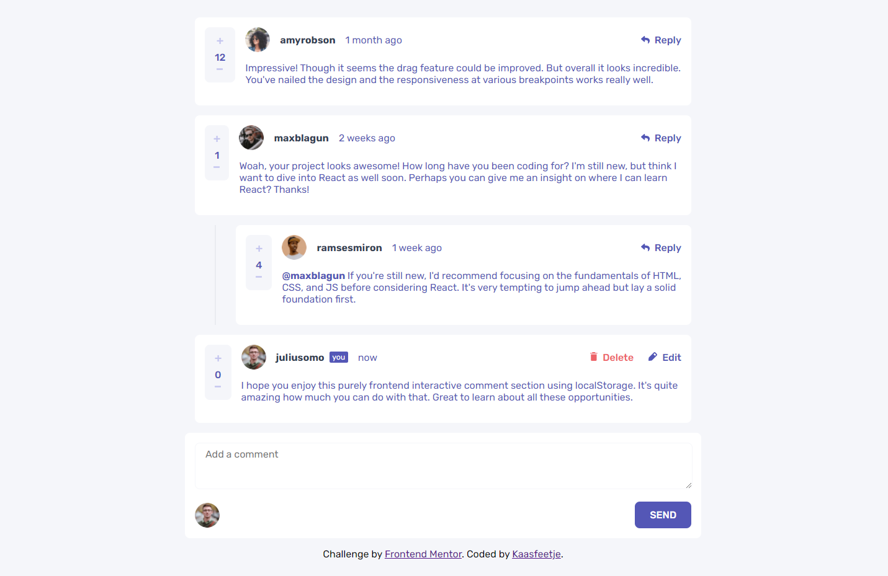
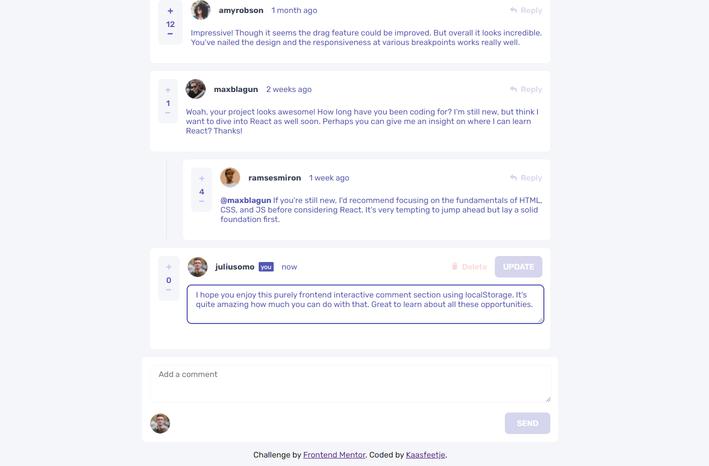
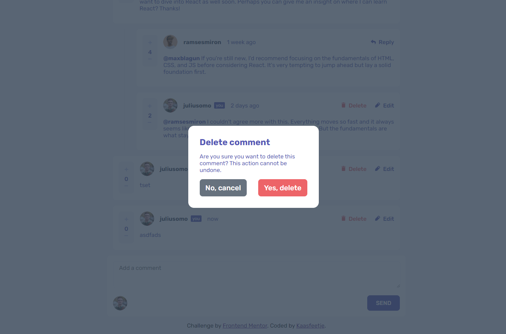
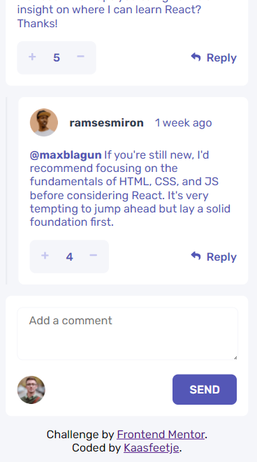
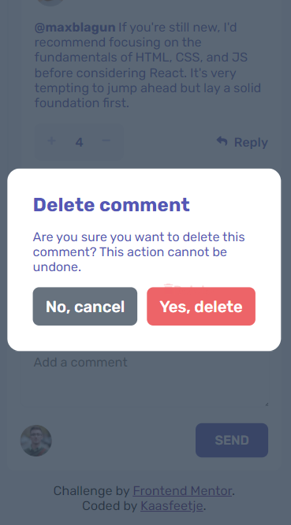

# Frontend Mentor - Interactive comments section solution

This is a solution to the [Interactive comments section challenge on Frontend Mentor](https://www.frontendmentor.io/challenges/interactive-comments-section-iG1RugEG9). Frontend Mentor challenges help you improve your coding skills by building realistic projects.

## Table of contents

-   [Overview](#overview)
    -   [The challenge](#the-challenge)
    -   [Screenshot](#screenshot)
    -   [Links](#links)
-   [My process](#my-process)
    -   [Built with](#built-with)
    -   [What I learned](#what-i-learned)
    -   [Useful resources](#useful-resources)
-   [Author](#author)

## Overview

### The challenge

Users should be able to:

-   View the optimal layout for the app depending on their device's screen size
-   See hover states for all interactive elements on the page
-   Create, Read, Update, and Delete comments and replies
-   Upvote and downvote comments
-   **Bonus**: If you're building a purely front-end project, use `localStorage` to save the current state in the browser that persists when the browser is refreshed.
-   **Bonus**: Instead of using the `createdAt` strings from the `data.json` file, try using timestamps and dynamically track the time since the comment or reply was posted.

### Screenshot

### Links

-   Solution URL: [Github](https://github.com/Kaasfeetje/Frontend-Mentor-Interactive-Comment-Section)
-   Live Site URL: [Site](https://interactive-comment-section-kaasfeetje.netlify.app/)

## My process

This was my first real challenging challenge. I started out with the crude JSX objects I was gonna use. It was a lot less advanced than it ended up as. Later I'd have to conditionally render the rating object and reply/edit/delete buttons, depending on different screen sizes.

My second step was opening up the json file and getting some sample data. At this point I did not put anything in localStorage yet. I just iterated over the comments and after that the replies. I figured out I could use the same object for reply as the comment itself. I also styled the components in this phase.

This is when I started working on the functionality. I basically check in <App> if there is comments in localStorage, if there is not then we fill it. If there is we use those. Whenever there is an update on the comments I refetch the comments from localstorage and update it.

### Built with

-   React
-   LocalStorage
-   CSS

### What I learned

I learned how to get and retrieve items from localStorage, I'd done this before but I had not made a project based on it. So that was quite challenging. I also learned that not using context can make your project a mess :).

### Useful resources

-   [localStorage](https://developer.mozilla.org/en-US/docs/Web/API/Window/localStorage) - This helped me with localStorage

## Author

-   Github - [Kaasfeetje](https://github.com/Kaasfeetje)
-   Frontend Mentor - [@Kaasfeetje](https://www.frontendmentor.io/profile/Kaasfeetje)
-   Twitter - [@veldhuisMax](https://www.twitter.com/veldhuisMax)
